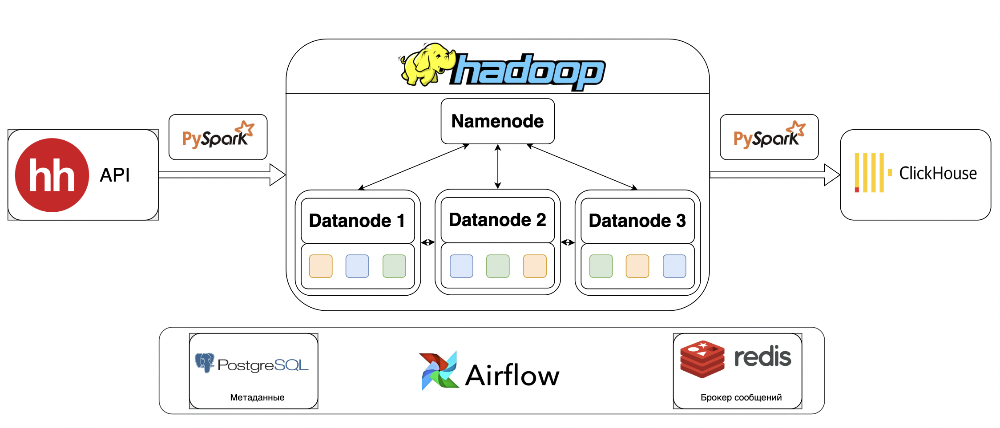

##### Hadoop_ETL
---------------------------------------------------------------------------------------------------------

---------------------------------------------------------------------------------------------------------
В рамках данного проекта реализован ETL-процесс. В качестве источника данных используется API от HeadHunter (сбор информации по актуальным вакансиям, в названии которых есть влово "Аналитик"). Сырые данные в формате parquet сохраняются в HDFS (можно заменить на S3). После чего данные очищаются и аггрегируются с использованием Pyspark. На следующем этапе реализована загрузка полученных данных в ClickHouse. В качестве оркестратора выступает Airflow.

---------------------------------------------------------------------------------------------------------
Проект можно запустить клонировав содержимое репозитория (git clone (https://github.com/Alakirr/Hadoop_ETL.git), а затем из папки с содержимым, поднять сеть контейнеров (docker compose up -d).  Метаданные для Airflow записываются в PostgreSQL. 

---------------------------------------------------------------------------------------------------------
Чтобы зайти в Airflow используйте логин airflow и пароль airflow. 
Для управления PostgreSQL используйте логин airflow, пароль airflow и название БД airflow. 

---------------------------------------------------------------------------------------------------------
В дальнейшем планируется расширить ETL:
1) увеличить объем данных (увеличение количества запросов к API/добавление синтетических данных);
2) добавить Superset/Grafana;
3) добавить DL-модель, которая будет определять зарплатную вилку по описанию вакансии.
